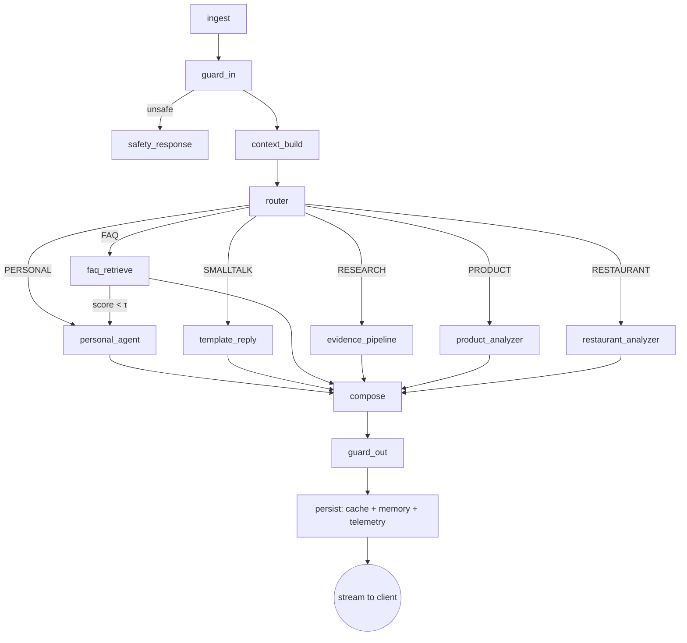

# Health & Product Assistant — Target Architecture (LangChain / LangGraph)

Version 1.0 · Design document · No implementation code

---

## 0. What is wrong with the current system

Before the target design, the constraints it has to fix. These come from reading `app.py` as it stands.

| # | Problem in current build | Consequence | Fixed by |
|---|---|---|---|
| P1 | Everything is one Flask module: routing, OCR, barcode, 6 upstream research APIs, LLM prompting, caching, chat. | Cannot test, scale or deploy any part independently. | §2 service decomposition |
| P2 | Ingredient research is **synchronous and per-request**: up to 15 ingredients × 6 upstream APIs + 1 LLM call each, inside the HTTP request. | A single scan is ~90 network calls; p95 latency is minutes; clients time out. | §8 precomputed Chemical KB + async jobs |
| P3 | Cache is JSON files on local disk keyed by a slugified string. | No sharing across replicas, no TTL, no invalidation, no eviction, no semantic hit. | §7 three-tier cache |
| P4 | The entire health dataset is shipped in the request body (`context.csv_health_data`) on every turn. | Huge payloads, no isolation guarantee, no server-side authorisation of what the user may see. | §6 server-side data plane + user-scoped tools |
| P5 | No routing intelligence — every message goes to a full LLM call with a giant system prompt. | Every "hi" and every FAQ costs a frontier-model call. | §5 router cascade |
| P6 | "Non-funded source" filter drops any paper that declares a grant. | Backwards: it discards NIH/EU/ICMR publicly funded work — the *most* independent evidence — and keeps unfunded, often lower-quality output. | §9.3 conflict-of-interest model |
| P7 | Prompt injection via a system-prompt directive (`barcode_product_not_found` → "REPLY WITH EXACTLY…"). | Control flow expressed as prose the model may ignore or leak. | §10 deterministic response assembly |
| P8 | `urllib.request.urlopen()` on any user-supplied URL. | SSRF into internal network / cloud metadata. | §13 fetch broker |
| P9 | LLM writes toxicology conclusions freely from paper abstracts. | Hallucinated safety claims in a health product. | §8.5 rules-first, LLM-explains-only |
| P10 | No evaluation, no tracing, no cost accounting. | Regressions invisible; spend unbounded. | §14 observability & evals |

---

## 1. Architectural principles

1. **Cheap paths first.** Deterministic → cached → retrieved → generated. An LLM call is the last resort, never the first.
2. **Retrieval decides facts, the model decides wording.** Hazard classifications, chemical properties and health values come from structured stores. The LLM narrates them; it does not invent them.
3. **Nothing expensive happens inside an HTTP request.** Anything unbounded (chemical research, deep web research, restaurant investigation) runs as a job with a result the chat turn can poll or subscribe to.
4. **State is a typed object, not a prompt.** LangGraph carries a validated Pydantic state between nodes; the system prompt is rendered from it at the last moment.
5. **Every claim carries provenance.** Source id, tier, retrieval timestamp, and the span it supports.
6. **User data never leaves its scope.** Tenancy is enforced at the repository layer, not by prompt instruction.
7. **Small models do small jobs.** Classification, extraction, normalisation, reranking → small/fast. Only final synthesis uses the large model.

---

## 2. System decomposition

```
┌────────────────────────────────────────────────────────────────────────┐
│  Mobile App / Web                                                      │
└───────────────┬────────────────────────────────────────────────────────┘
                │ HTTPS, JWT, SSE stream
┌───────────────▼────────────────────────────────────────────────────────┐
│  API Gateway  (FastAPI, async)                                         │
│  authn/z · rate limit · payload limits · request id · SSE streaming     │
└───────────────┬────────────────────────────────────────────────────────┘
                │
┌───────────────▼────────────────────────────────────────────────────────┐
│  Orchestrator  (LangGraph)  — the conversation graph, §4               │
└──┬────────┬────────┬────────┬────────┬────────┬───────────┬────────────┘
   │        │        │        │        │        │           │
   ▼        ▼        ▼        ▼        ▼        ▼           ▼
┌──────┐ ┌──────┐ ┌──────┐ ┌──────┐ ┌──────┐ ┌────────┐ ┌──────────┐
│ FAQ  │ │Cache │ │User  │ │Evid- │ │Product││Restaurant││ Memory   │
│Svc   │ │Svc   │ │Data  │ │ence  │ │Analyzer││ Analyzer││ Svc      │
│ §5   │ │ §7   │ │ §6   │ │ §9   │ │  §8   ││   §11   ││  §12     │
└──────┘ └──────┘ └──────┘ └──────┘ └───┬───┘└────┬────┘└──────────┘
                                        │         │
┌───────────────────────────────────────▼─────────▼──────────────────────┐
│  Async Job Plane  (Celery / ARQ + Redis)                               │
│  chemical-research · deep-research · restaurant-investigation · ETL     │
└───────────────┬────────────────────────────────────────────────────────┘
                │
┌───────────────▼────────────────────────────────────────────────────────┐
│  Data Plane                                                            │
│  Postgres (+pgvector) · Redis · Object store · Search index            │
└────────────────────────────────────────────────────────────────────────┘
```

### 2.1 Repository layout

```
apps/
  api/                  FastAPI app — HTTP only, no business logic
  worker/               job consumers
  admin/                FAQ authoring, chemical KB curation, eval dashboard
packages/
  orchestrator/         LangGraph graphs, state schema, node implementations
  chains/               LCEL chains (classify, extract, summarise, personalise)
  retrievers/           FAQ, chemical, evidence, cache retrievers
  tools/                LangChain @tool definitions bound to user scope
  connectors/           OFF, OBF, PubChem, PubMed, EuropePMC, Places, OCR, …
  domain/               Pydantic models — the shared contract
  storage/              repositories, migrations, vector store adapters
  guards/               PII, injection, safety, allowlists
  evals/                golden sets + harness
```

---

## 3. Data plane

| Store | Holds | Why |
|---|---|---|
| **Postgres** | users, consent scopes, health/nutrition/medical records, FAQ items, chemical dossiers, product cache, conversation log, job records, evidence documents | one transactional source of truth |
| **pgvector** (same PG) | FAQ embeddings, semantic-cache embeddings, evidence chunks, ingredient synonym embeddings | avoids a second system until scale demands it |
| **Postgres FTS (tsvector)** | lexical half of hybrid retrieval | exact-token recall that embeddings miss (INCI names, E-numbers) |
| **Redis** | L2 exact cache, rate limits, job queue, idempotency keys, distributed locks | sub-ms, shared across replicas |
| **Object store (S3/GCS)** | uploaded images, rasterised PDF pages, OCR artefacts | keeps blobs out of Postgres and out of the request body |
| **Search index (optional, later)** | if evidence corpus outgrows pgvector | swap behind the retriever interface |

**Key schema shift:** the app stops sending `csv_health_data` in the payload. Health data lives in Postgres, written by the app's sync path, read by user-scoped tools. The chat request carries only `user_id`, `session_id`, `message`, `attachments[]`.

---

## 4. The conversation graph (LangGraph)

### 4.1 State object

```
ConversationState
  request:      user_id, session_id, turn_id, locale, client_version
  input:        text, attachments[], client_hints
  consent:      granted_scopes[], masking_policy
  context:      UserContext          (§6)
  route:        RouteDecision        (label, confidence, rationale, fallbacks[])
  candidates:   faq_hits[], cache_hits[], evidence_docs[], analyzer_result
  draft:        answer_blocks[], citations[], disclaimers[]
  telemetry:    node_timings, token_costs, cache_status
  flags:        safety_flags[], data_gaps[], degraded_sources[]
```

Everything is Pydantic-validated on node exit. A node may only write the fields it owns.

### 4.2 Graph



A **cache probe** runs immediately after `router` for every branch except `PRODUCT`/`RESTAURANT` with new attachments; a hit short-circuits straight to `compose`.

### 4.3 Node responsibilities

| Node | Does | Does not |
|---|---|---|
| `ingest` | normalise attachments, store to object store, rasterise PDFs, return handles | call OCR |
| `guard_in` | PII scrub for logs, injection detection on attachment text, safety triage (self-harm, emergency symptoms, minors) | answer |
| `context_build` | assemble `UserContext` from parallel, consent-filtered, cached reads | ship raw datasets into the prompt |
| `router` | produce `RouteDecision` via the §5.3 cascade | generate content |
| branch nodes | produce structured `answer_blocks` + `citations` | format prose for the user |
| `compose` | render template/LLM prose from blocks, personalise, attach citations & disclaimers | discover new facts |
| `guard_out` | claim-vs-citation check, medical-advice policy, PII leak check, allergen assertion check | silently rewrite facts |
| `persist` | write cache entries with correct keys/TTLs, update rolling memory, emit traces | block the response |

Streaming: `compose` streams tokens; `persist` runs after the stream closes.

---

## 5. Requirement 1 — Predefined Q&A system

### 5.1 Knowledge base model (1.1, 1.2)

```
FaqItem
  id, version, status(draft|review|live|retired)
  category           General | Nutrition | Workout | Medical | Product | AppSupport
  canonical_question
  paraphrases[]      authored + mined from real logs
  answer_template    Jinja with typed slots
  variants           { with_data, without_data, short, long }
  required_slots[]   e.g. weight_kg, avg_sleep_7d
  personalisation_rules[]
  safety_class       informational | guidance | medical_sensitive
  locale, effective_from, effective_to
  owner, reviewed_by, reviewed_at
```

Authoring lives in the admin app, not in code. Every change is versioned; `live` requires a reviewer. `medical_sensitive` items require clinical sign-off before going live.

Category taxonomy (1.1.2) is a first-class table, because the router, the cache TTL policy, the disclaimer policy and the evaluation slices all key off it.

**Paraphrase mining loop:** unmatched user questions are clustered weekly; clusters above a volume threshold become FAQ candidates in the admin queue. This is how 1.1.1 stays true over time instead of being a one-off exercise.

### 5.2 Retrieval engine (1.4)

Hybrid, three stages:

1. **Exact** — normalised-string hash lookup (lowercase, strip punctuation, expand contractions, canonicalise units). O(1), no model.
2. **Hybrid candidate generation** — top-50 by BM25 (tsvector) ∪ top-50 by embedding cosine over `canonical_question + paraphrases`, fused with Reciprocal Rank Fusion. Lexical recall matters: "TDEE", "BMR", "INCI" are tokens embeddings blur.
3. **Rerank** — cross-encoder (or small-LLM pairwise) over top-20 → final score in [0,1].

Each surface form is its own vector row pointing at one `FaqItem`, so a paraphrase hit is a direct hit rather than an averaged one.

### 5.3 Query classification & the decision (1.3)

A cascade, cheapest first. Each stage can decide or defer.

| Stage | Cost | Decides |
|---|---|---|
| S0 rules | ~0 | attachments present → `PRODUCT`; place entity + review intent → `RESTAURANT`; greeting/thanks → `SMALLTALK`; safety trigger → `UNSAFE` |
| S1 exact FAQ | ~0 | hash hit → `FAQ` |
| S2 embedding | ~5 ms | reranked score ≥ τ_faq → `FAQ`; ≤ τ_low → not FAQ |
| S3 semantic cache | ~5 ms | ≥ τ_cache and context fingerprint valid → `CACHED` |
| S4 small-LLM classifier | ~200 ms | the ambiguous band only; returns label + confidence + rationale |

Thresholds (τ_faq, τ_cache, τ_low) are **config, not constants** — tuned per category against the eval set, since Medical wants high precision and AppSupport wants high recall.

Every decision writes `RouteDecision{label, confidence, stage, rationale}` to the trace. The router's confusion matrix against a labelled golden set is a tracked metric (§14).

**Fallback rule:** `FAQ` and `CACHED` are provisional. If `required_slots` cannot be filled or the answer fails `guard_out`, the graph falls through to `personal_agent` rather than emitting a half-personalised template.

### 5.4 Response generation (1.5)

Deterministic template render first. Personalisation is slot substitution plus rule-selected variants — *not* a rewrite pass. An optional light LLM "tone" pass runs only for `informational` items and is skipped entirely for `medical_sensitive`, where the reviewed wording must survive intact.

---

## 6. Requirement 2 — User data integration

### 6.1 Sources → one typed context

```
UserContext
  profile        name?, age_band, sex, height, weight, goals[], preferences[]
  vitals         latest + 7d/30d rolling: recovery, strain, sleep, RHR, weight
  nutrition      latest day + rolling means, diet-quality trend
  medical        latest report: BMI, BP, HbA1c, lipids, flags, conditions[], allergies[]
  activity       recent sessions, weekly volume by type
  derived        trends, streaks, deltas, adherence, anomalies
  meta           per-section freshness, completeness, consent scope
```

**Aggregates are precomputed**, not calculated per request — a nightly/incremental job maintains rolling windows. `context_build` does bounded indexed reads with a 60-second per-user Redis cache, all sections fetched in parallel.

### 6.2 Tools instead of dumped data (2.4)

The prompt receives a *summary*. Detail is reached through user-scoped LangChain tools:

`get_metrics_for_date` · `summarise_metric(metric, range)` · `get_trend(metric, days)` · `list_activities(type?, limit)` · `get_nutrition_day(date)` · `get_latest_labs()` · `compare_periods(metric, a, b)`

Each tool is constructed with the caller's `user_id` bound at build time. A tool physically cannot address another user's rows — tenancy is a repository predicate, not a prompt instruction.

### 6.3 Privacy (2.5)

- **Consent scopes** per data class (`vitals`, `nutrition`, `labs`, `location`); `context_build` filters by granted scope and records what was withheld in `flags.data_gaps`.
- **Masking**: names, exact DOB, addresses, phone, IDs replaced by tokens before any text leaves the boundary to a model provider; detokenised on the way back in `compose`.
- **Isolation**: `user_id` is a partition key in cache keys, vector namespaces and job payloads.
- **Retention**: attachments TTL'd; raw OCR text purged after the derived record is written; conversation logs redacted at rest.
- **Zero-retention** provider endpoints for any call carrying medical values; a policy flag on each chain declares whether it may see labs at all.

---

## 7. Requirement 3 — Caching

### 7.1 Three tiers

| Tier | Where | Latency | Scope |
|---|---|---|---|
| L1 | in-process LRU | µs | per replica, hot FAQ/templates |
| L2 | Redis, exact key | ~1 ms | all replicas, exact repeats |
| L3 | pgvector semantic | ~10 ms | paraphrased repeats |

### 7.2 The cache key is the whole design

```
key = hash(
   normalised_question,
   route_label,
   scope,                    # "global" | user_id  ← personalised answers never leak
   context_fingerprint,      # versions of profile/vitals/nutrition/labs actually used
   locale,
   prompt_version,
   model_id,
   kb_version                # FAQ + chemical KB revision
)
```

`context_fingerprint` is built from the *sections the answer actually read*, so a nutrition answer is not invalidated by a workout sync. That single property is what makes personalised caching safe.

### 7.3 Validity & invalidation (3.3, 3.4)

- **TTL by category:** AppSupport 30 d · General 14 d · Nutrition/Workout 24 h · Product analysis 7 d · Research 7 d · Medical-sensitive 1 h.
- **Event-driven bust:** profile edit, new health sync, new lab report, FAQ publish, chemical dossier update, prompt/model version bump.
- **Semantic-hit verification:** an L3 hit is not returned blind. It must (a) exceed τ_cache, (b) carry a compatible context fingerprint, (c) pass a cheap entailment check for `medical_sensitive`. Otherwise treated as a miss.
- **Negative caching:** upstream failures cached for 60 s only, never persisted as answers.
- **Never cached:** anything with `safety_flags`, anything the user flagged as wrong, streaming partials.
- **Eviction:** Redis LRU + TTL; pgvector rows pruned by a nightly job on `last_hit_at` and hit count.

### 7.4 Metrics

Hit rate by tier and category · staleness incidents · cost avoided per day · false-hit rate sampled by human review. A false-hit rate above threshold raises τ_cache automatically.

---

## 8. Requirement 5 — Product analyzer (barcode / OCR)

The most important change: **research moves offline**. The runtime path becomes lookups against a curated Chemical Knowledge Base.

### 8.1 Runtime pipeline

```mermaid
flowchart LR
    A[capture: images / PDF] --> B[preprocess<br/>deskew, crop, enhance]
    B --> C{decode barcode}
    C -->|product code| D[identify product]
    C -->|none / non-retail| E[OCR label]
    D -->|found w/ ingredients| G[ingredient text]
    D -->|not found| E
    E --> F[panel detection<br/>+ text assembly]
    F --> G
    G --> H[parse + normalise<br/>to chemical ids]
    H --> I[Chemical KB lookup]
    I -->|all known| J[hazard rules engine]
    I -->|unknown| K[enqueue research job<br/>return 'pending']
    J --> L[personal risk match]
    L --> M[LLM explanation layer]
    M --> N[structured verdict + citations]
```



### 8.2 Input & identification (5.1, 5.2)

- **Barcode:** keep the current product-format gate (retail symbologies only, GS1 AI parsing, digit-payload check) — that logic is sound. Add: multi-frame voting from the scanner, check-digit validation, GTIN-8/12/13/14 normalisation.
- **Identification cascade:** local product table → OpenFoodFacts → OpenBeautyFacts → OpenProductFacts → GS1 registry → brand/retailer connectors → user-contributed submissions. Each result stored with source, confidence and fetch time.
- **OCR:** one pass per image, results stored and reused everywhere (the current double-OCR disappears because OCR is its own step with its own cache keyed on image hash). Add ingredient-panel region detection so the parser is handed the panel, not the whole pack; support multi-image stitching for a wrapped label.

### 8.3 Ingredient parsing & normalisation (5.3.1)

A dedicated normaliser, not a regex in the request path:

1. Segment the panel (header detection, stop-section detection — the existing rules are a good starting point).
2. Tokenise on separators, strip percentages, quantities, list numbering, parentheticals (keeping them as qualifiers, not discarding).
3. **Resolve to a chemical id** via: exact INCI match → CAS/EC/E-number match → synonym table → fuzzy match (edit distance + phonetic + an OCR confusion model for `0/O`, `1/l`, `rn/m`) → embedding nearest-neighbour over the synonym corpus.
4. Emit `ResolvedIngredient{raw_token, chemical_id?, confidence, resolution_method}`. Unresolved tokens are surfaced as "not recognised", never silently researched or silently dropped.
5. Deduplicate on `chemical_id`, preserving declaration order (order carries concentration meaning on INCI panels).

### 8.4 Chemical Knowledge Base (5.3.2)

A curated store, built by an **offline ETL**, not by live fan-out:

```
ChemicalDossier
  chemical_id, inci_name, cas, ec, e_number, synonyms[]
  identity        formula, class, function(s)
  hazard          GHS codes, EU CLP, IARC group, ECHA SVHC, Prop 65
  regulatory      EU Annex II/III status, FDA status, FSSAI status, limits by category
  endocrine       TEDX / EU EDC list membership, evidence strength
  allergen        EU 26 fragrance allergens, common contact allergens
  absorption      oral / dermal / inhalation / injection, with evidence grade
  evidence[]      citations with source tier, study design, year
  provenance      per-field source + fetched_at + reviewer
  kb_version
```

ETL sources: PubChem, ECHA CLP inventory, EU CosIng, IARC monographs, EWG-adjacent public datasets, FDA/FSSAI registries, PubMed/EuropePMC for absorption evidence. Runs on a schedule, is reviewable, and is versioned. **A scan at runtime touches zero external toxicology APIs.**

Unknown ingredient → job enqueued → response says "3 of 14 ingredients still being researched" with a subscription for the update. Coverage of the top ~5,000 INCI ingredients removes this case for almost every real scan.

### 8.5 Hazard assessment (5.3.3) — rules, not a model

A deterministic rules engine over the dossier produces:

- hazard level (per category: cosmetic / food / drug — the same chemical is not equally concerning in both)
- toxicity summary with evidence grade
- endocrine-disruptor flag with list membership
- carcinogenicity with the issuing authority and group
- restricted/banned status per jurisdiction, with the user's jurisdiction applied
- concentration caveat where the panel implies position-based concentration

Rules are declarative and versioned so a verdict can be reproduced and audited. **The LLM never assigns a hazard level.**

### 8.6 Personal risk & summary (5.3.4)

Rule match against `UserContext`: declared allergies (with cross-reactant expansion), conditions, pregnancy status, age band, dietary restrictions. Produces `PersonalFlag{chemical, reason, severity, source_of_rule}`.

The LLM's only job is the explanation layer: given the structured findings, write per-ingredient plain-language explanations, an overall assessment, and a verdict phrase drawn from a **fixed enum** (`Generally suitable` / `Use with caution` / `Not recommended for you` / `Insufficient data`). `guard_out` verifies every ingredient the prose names appears in the structured findings and that the verdict matches the enum value the rules produced.

### 8.7 Product-not-found handling

Replaced entirely: no prompt directive. When identification fails, the graph emits a deterministic `answer_block` of type `product_unidentified` with a client-renderable action ("photograph the ingredient panel"). The distinction the current code makes — *unreadable* vs *non-retail symbol* vs *unlisted product* — is preserved as three distinct block subtypes, because the right user action differs in each.

---

## 9. Requirement 4 — Evidence & references

### 9.1 Pipeline

```
intent extraction → entity normalisation (MeSH / INCI / CAS / food code)
  → query expansion per source → parallel bounded fetch across allowlisted sources
  → dedupe (DOI / PMID / URL canonicalisation) → tier + quality rerank
  → chunk & extract → grounded synthesis → claim verification → citations
```

### 9.2 Source tiering (4.2)

| Tier | Sources | Weight |
|---|---|---|
| T1 government / intergovernmental | WHO, NIH/NLM, CDC, FDA, EPA, EFSA, ECHA, NHS, Health Canada, TGA, ICMR, FSSAI/FoSCoS | highest |
| T2 systematic evidence | Cochrane, PROSPERO-registered reviews, guideline bodies | high |
| T3 peer-reviewed primary | PubMed, EuropePMC, OpenAlex, Crossref, Semantic Scholar | medium, design-weighted |
| T4 reputable secondary | academic institutions, professional bodies | low, context only |
| blocked | content farms, supplement retailers, unattributed health blogs | never |

The allowlist is a table with an owner and a review date — not a hardcoded set.

### 9.3 Replacing the "non-funded" filter (important)

The current rule — *drop any paper that declares a grant* — inverts the intended signal. Publicly funded research (NIH, EU Horizon, ICMR, Wellcome) is exactly the independent evidence the requirement is reaching for; unfunded work skews toward lower-powered and non-peer-reviewed output.

Replace it with an **independence score**:

```
independence = f(
   funder_class,        # public / charitable / none  → high
                        # industry / trade association → low
   declared_COI,        # author conflicts of interest
   author_affiliation,  # manufacturer-employed authors
   sponsor_role,        # sponsor involvement in design/analysis/writing
   registry_status      # pre-registered, protocol available
)
```

Then rank by `tier × independence × study_design × recency`, and *show* the score rather than silently filtering. Industry-funded studies are labelled, not hidden — that is more defensible and more useful.

### 9.4 Synthesis & citation integrity (4.4)

Extract → summarise per source → synthesise across sources, with each output sentence carrying the chunk ids that support it. A verification pass checks entailment of each claim against its cited spans; unsupported sentences are dropped or downgraded to "limited evidence". Conflicting findings are reported as disagreement, not averaged away.

Caching is keyed on the **normalised entity + intent**, not the phrasing — "is sodium lauryl sulfate bad" and "SLS safety" hit the same entry.

Broad questions exceeding a source budget become an async deep-research job rather than a slow synchronous turn.

---

## 10. Response assembly

`compose` consumes typed blocks and emits both a rendered message and a machine-readable payload the app can render natively:

```
AnswerPayload
  blocks[]        text | faq_answer | metric_card | ingredient_table |
                  hazard_badge | evidence_list | product_unidentified | action_prompt
  citations[]     source, tier, url, retrieved_at, supports_block_ids[]
  disclaimers[]   selected by safety_class + content type
  confidence      overall, with the reason for any downgrade
  data_gaps[]     what was missing and how the user can supply it
  route_debug     (internal only)
```

Disclaimer policy is a rule table keyed on category and content, so medical framing is consistent and auditable rather than left to the model.

---

## 11. Restaurant analyzer

### 11.1 Pipeline

```
1. Resolve place   Google Places / Business Profile → canonical place_id,
                   address, brand chain id, branch disambiguation
2. Regulatory      health-inspection open data portals; India: FoSCoS / FSSAI
                   licence status and validity; closure & prosecution notices
3. Recalls         food-safety recall feeds touching the brand
4. News            allowlisted news search, entity- and date-scoped
5. Complaints      review-corpus mining for illness/hygiene signals
                   (classifier, not keyword match)
6. Score & assemble
```

### 11.2 The two hard problems

**Entity disambiguation.** "Domino's" complaints in another city are not this branch's. Every finding must bind to a resolved place or an explicitly-labelled brand-level scope. Findings are tagged `branch` / `brand` / `unresolved`, and unresolved findings are excluded from the score.

**Defamation exposure.** Output reports sourced facts with dates and links, and never renders an unsourced verdict. Aggregate signals are stated as signals ("2 hygiene complaints in the last 12 months, both unverified user reports"), never as fact about current conditions. A "no adverse findings located" state is a first-class result — the absence of data is reported honestly rather than read as a clean bill of health.

### 11.3 Execution

Runs as an async job with progressive results (place resolved → regulatory → news → complaints), streamed to the chat turn. Cached 7 days per place_id, busted on new inspection or recall.

---

## 12. Conversation memory

- **Short-term:** last N turns verbatim, token-budgeted.
- **Rolling summary:** updated asynchronously after the turn (never on the critical path), storing durable facts only — goals, constraints, preferences, recurring topics.
- **Structured memory:** extracted facts written to typed rows (`goal`, `dietary_restriction`, `disliked_exercise`) so they can be *queried* and shown to the user, not just prepended as prose.
- **User-visible and editable.** A user can see and delete what the assistant remembers. Deletions bust the affected caches.

---

## 13. Model & provider strategy

| Job | Class | Notes |
|---|---|---|
| routing, classification | small | latency-critical, high volume |
| ingredient extraction, entity normalisation | small, structured output | schema-constrained decoding |
| reranking | cross-encoder or small LLM | not the frontier model |
| per-source summarisation | mid | parallel, bounded |
| final synthesis, explanation | large | the only frontier-class call |
| memory summarisation | small, async | off critical path |

Provider abstraction (OpenAI / DeepSeek / HF) is retained via LangChain's chat-model interface, with declared per-chain requirements (tool calling, structured output, context length, data-residency). Fallback chains handle provider outage; circuit breakers stop retry storms. Structured outputs use schema-constrained generation, replacing the current "parse JSON out of prose" retry loop.

**Security fixes carried into the design:** a fetch broker mediates all outbound URL access (allowlist, DNS pinning, private-range blocking, size and time caps) — closing the SSRF hole; attachment size/count/type limits at the gateway; per-user and per-IP rate limits; signed URLs for object-store reads.

---

## 14. Observability, evaluation, cost

**Tracing** — every turn is one trace: node timings, route decision + confidence, cache tier hit, tokens and cost per model call, upstream latencies and failures.

**Golden sets, run in CI on every prompt or model change:**

| Set | Measures | Gate |
|---|---|---|
| router | label accuracy, confusion matrix | no regression |
| FAQ retrieval | recall@1, precision at τ | ≥ baseline |
| ingredient parsing | token→chemical resolution F1 on real labels | ≥ baseline |
| hazard rules | exact match vs curated verdicts | 100% (deterministic) |
| citation faithfulness | claim-level entailment against cited spans | ≥ threshold |
| personalisation safety | no allergen missed on synthetic profiles | 100% |
| cache correctness | sampled false-hit rate | below threshold |

**Cost controls** — per-request token budget, per-user daily budget, per-job source budget, alerting on cost-per-turn drift. Cache hit rate is a headline metric because it is the primary cost lever.

---

## 15. Migration plan (strangler fig)

| Phase | Work | Ships when |
|---|---|---|
| **0. Scaffold** | new repo layout, domain models, Postgres schema, tracing, eval harness. Old Flask app untouched. | infra green |
| **1. Data plane** | health/nutrition/medical move server-side; app writes via sync API; tools read from Postgres. Old payload path accepted but ignored, then removed. | tools match old outputs on replay |
| **2. Orchestrator skeleton** | LangGraph graph with `PERSONAL` branch only, behind a feature flag; shadow-run against the old path and diff. | diff acceptable on golden set |
| **3. FAQ + cache** | authoring UI, seed KB from top ~200 real questions, router S0–S3, three-tier cache. Immediate cost drop. | hit rate ≥ target |
| **4. Chemical KB** | ETL for top INCI/food ingredients, hazard rules engine, dossier store. Runtime still allowed to fall back to the old live pipeline. | coverage ≥ 90% of scanned tokens |
| **5. Analyzer cutover** | new product pipeline on; live per-ingredient fan-out deleted; async job path for unknowns. | p95 scan latency target met |
| **6. Evidence service** | tiered sources, independence scoring, citation verification. Replaces the six-API fan-out for research questions. | faithfulness gate passed |
| **7. Restaurant analyzer** | new capability, async from day one. | — |
| **8. Decommission** | delete `app.py`, file-based cache, prompt-directive control flow. | traffic fully migrated |

Each phase is independently shippable and independently reversible.

---

## 16. Open decisions for you

1. **Jurisdiction scope.** India-first (FSSAI/FoSCoS/ICMR) or multi-market from the start? It changes the regulatory tables and the hazard rules materially.
2. **Chemical KB build vs licence.** Curating 5,000 dossiers is real work; licensed toxicology data may be cheaper than the ETL plus curation time.
3. **Async UX contract.** How does the app present "still researching 3 ingredients"? This shapes the job/subscription API.
4. **Medical liability posture.** How close to individualised medical advice is the product willing to go? This sets the `medical_sensitive` policy, the disclaimer table, and whether clinical review is mandatory.
5. **Self-hosted vs API models.** Data residency for lab values may force a self-hosted small model for anything that touches `medical`.
6. **Restaurant data sources.** Inspection open data varies wildly by city; the realistic coverage map should be checked before this feature is promised.